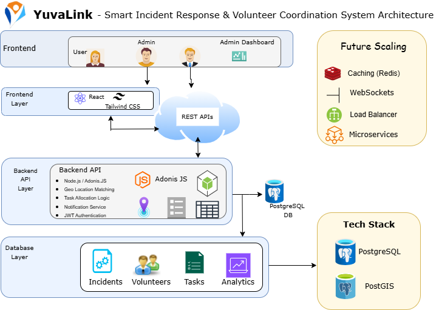
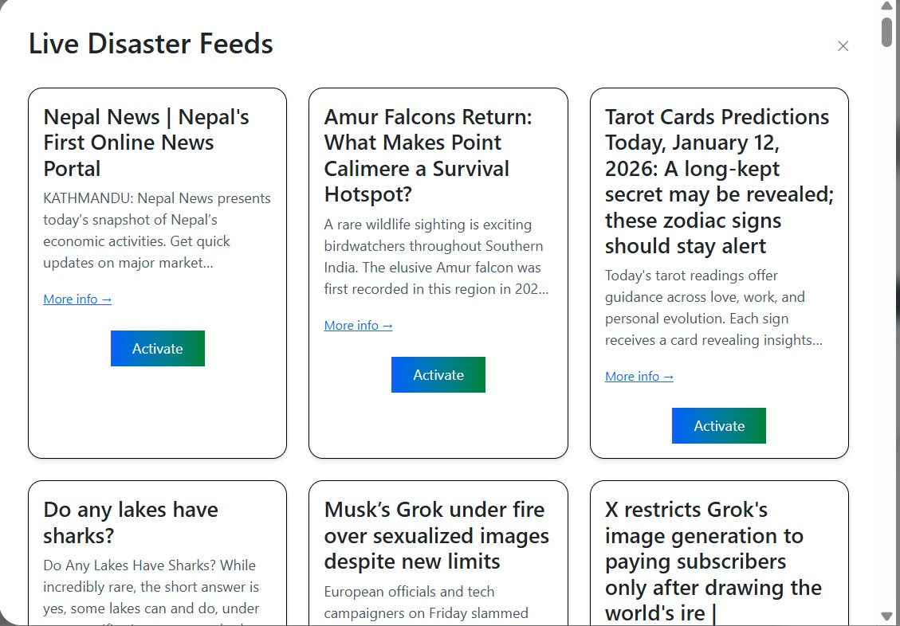
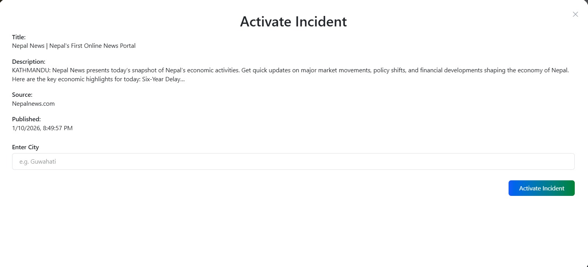
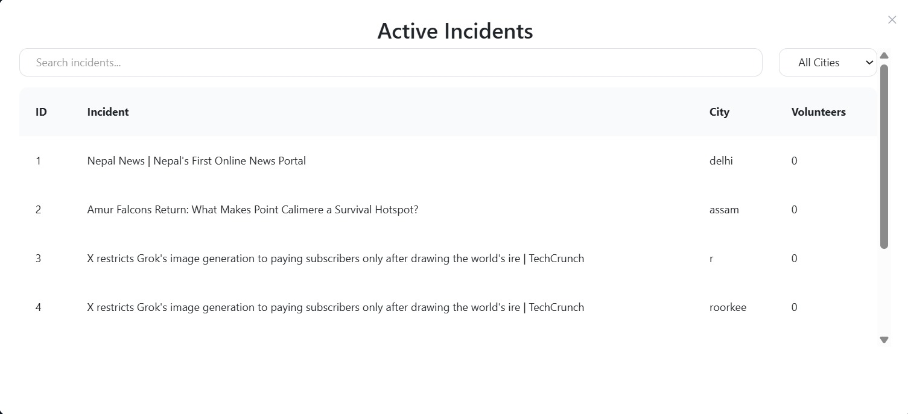
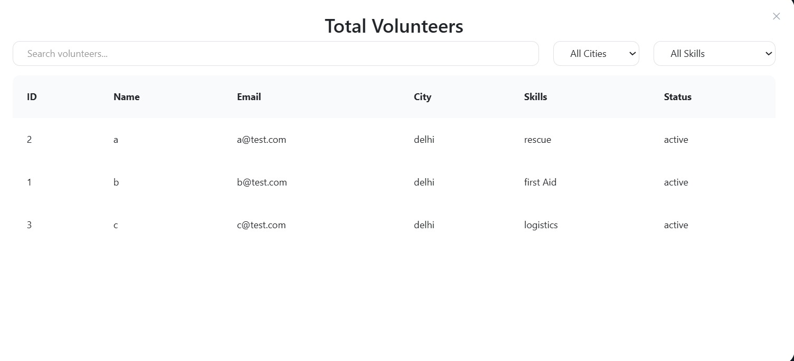

<div align="center">
 <span>
 
</span>
</div>

# YuvaLink
here is our Demo video [YuvaLink](https://drive.google.com/file/d/1RN11yOQ4rzzq33mBwm4UAPdSagL5YcQ_/view?usp=sharing)

## Problem Statement
In Disaster situations,information about the incident usually reaches authorities through traditional ways helplines and control rooms.
However,the Real- challenge begins after that-Coordinating volunteers efficiently and safely.
```
Disaster Occurs
      |-->Public informs authorities via helplines/control rooms
      |-->Authorities have volunteer support but lack real-time coordination tools
      |-->unverified volunteers
      |-->Resource duplication in some areas
      |-->Everything becomes very chaotic
```
## Improvements from Round 1 to Round 2

- Converted static volunteer listings into geo-based real-time task allocation.
- Introduced accept/decline logic with decline limits to prevent volunteer misuse.
- Added WebSocket-based real-time updates for tasks and incident status.
- Designed a scalable system architecture with defined failure-handling strategies.
- Clearly divided system ownership across team members for better integration.

## Solution Overview
* Dual-dashboard architecture separates disaster control (Admin) from execution (Volunteers), ensuring fast and structured response.
* Automated disaster detection using News API combined with human verification, preventing false activations.
* Live location–based volunteer filtering enables instant identification of nearest, verified responders.

* Smart task allocation system with accept/decline logic and abuse prevention through decline limits.

* Automatic team formation with capped team size and dynamic leadership assignment.

* Controlled real-time communication allowing only authorized team leads to interact with admins, reducing chaos during emergencies.
  
## Repository Link
* [YuvaLink](https://github.com/bhavyaagarwal25/YuvaLink)
* [YuvaLinkFrontEnd](https://github.com/Ayushmangit/yuvalinkFrontendHack.git)
* [YuvaLinkBackEnd](https://github.com/Ayushmangit/yuvalinkBackend)

## System Architecture



### Architecture Overview
YuvaLink is designed as a scalable disaster response and volunteer coordination system.
The architecture follows a layered approach to ensure reliability, real-time coordination and controlled communication during emergency situations.

### Frontend Layer
Frontend is developed using React and Tailwind CSS and provides separate interfaces for different roles:

-**Volunteer Interface**
- View nearby disaster incidents
- Receive and respond to task assignments
- Track task status in real time

-**Admin Interface**
- Verify and activate disaster events
- Create and manages tasks
- Monitors volunteer participation
- Communicate with designated team leaders


### API Communciation Layer

All frontend interactions communicate with the backend through secure REST APIs.
It ensures :
- Stateless communciation
- Secure request handling
- Clean separation between UI and backend logic

### Backend Application Layer

The backend is built using Node.js with AdonisJS and is responsible for all core system logic:

**Authentication & Authorization**
- JWT - based authentication
- Role-based access control for admin and volunteers
  
**Disaster Detection & Verification**
- Automatic incident from News API
- Admin verifies these incidents to prevent false alerts

**Task Allocation &  Team Formation**
-  Geo-location based volunteer matching
-  Smart task allocation with accept/decline tasks
-  Automatic team creation with team size of 15
-  Dynamic team leader assignment (Tier2)

### Data Layer

YuvaLink uses PostgreSQL with PostGIS to efficiently manage structured data:

- Incident data (location, severity, status)
- Volunteer profile and verification status
- Task assignments and team information
- Analytics and operational logs
## ERDiagram

## Growth & Scaling Strategy

### Phase 1: City-Level Deployment
- Single backend instance with PostgreSQL + PostGIS.
- Redis used for volunteer availability and decline tracking.
- WebSockets support real-time task updates.

### Phase 2: Multi-City Scale
- City-based sharding for incidents and volunteers.
- Separate task allocation service.
- Redis clusters per region with load-balanced WebSocket servers.

### Phase 3: National Scale
- Disaster detection and task allocation as independent services.
- Event-driven communication for task assignment.
- Read replicas for analytics and monitoring.

**Primary Bottlenecks & Mitigation**
- WebSocket concurrency → horizontal scaling
- Geo queries → regional sharding
- Task assignment latency → async processing

## Failure Handling & Safety Mechanisms

- **False Disaster Alerts:** Admin verification prevents automatic activation.
- **Volunteer Abuse:** Repeated task declines trigger temporary cooldowns.
- **Leader Failure:** Team leadership is reassigned automatically.
- **Network Issues:** WebSocket failures fall back to REST-based polling.
- **Cache Failure:** System degrades gracefully using database state.

System prioritizes reliability and controlled coordination during emergencies.


## System Flow 

### (Admin Interface)

### 1. Live Disaster Detection
The system fetches real-time disaster-related news using News API.  
Admins review incoming alerts before taking any action.



### 2. Incident Verification & Activation
Admins manually verify selected incidents and activate them to avoid false or duplicate disaster responses.



### 3. Active Incident Management
Once activated, incidents are listed on the admin dashboard where their status and city-wise deployment can be monitored.



### 4. Volunteer Availability & Skill View
Admins can view verified volunteers along with their city, skills, and current status to ensure proper task allocation.




## Impact & Usefulness

YuvaLink helps authorities manage volunteers in a faster, safer and more organized way during disaster situations.

### Real-World Impact

- **Faster help during disaster**
  Assigns nearby verified volunteers in real time, reducing response delays.

- **Safe and Trusted Volunteers**
  All volunteers are verified based on identity, skills and availability.
  This prevents fake or untrained volunteers from participating in emergencies.

- **Better Use of Resources**
  Tasks are allocated based on volunteer skills and location.
  This avoids duplication of work and ensures all areas receive proper support.


### Who benefits from YuvaLink

**Authorities & NGOs**
- Can see volunteer availability in real time
- Can assign tasks in structured way
- Can monitor progress easily

**Volunteers**
- Get tasks that match their skills
- Work in organized teams with clear roles
- Participate safely during emergencies

**Affected People**
- Receive faster and more organized help
- Reduced response time can help ssave lives


## Team Contributions

- **Bhavya Agarwal**
  Designed and implemented the Admin Dashboard(Frontend) with News API Integration.
  
- **Anushka Negi**
  Designed the Volunteer Dashboard(frontend) and implemented real-time updates using WebSockets.
  
- **Saurabh Singh**
  Managed Database design using Lucid ORM and handled Volunteer verification logic.
  
- **Ayushman Chauhan**
  Developed Backend services including user authentication, APIs and system integration.
  

## Future Scope

- **Mobile Application Support**  
  Native Android and iOS apps for faster volunteer onboarding and real-time alerts.

- **Real-Time Notifications**  
  Push notifications for task assignment, incident updates, and emergency alerts.

- **Advanced Analytics Dashboard**  
  Insights on response time, volunteer efficiency, and incident trends for better decision-making.

- **Offline Mode for Volunteers**  
  Allow volunteers to view assigned tasks even with limited network connectivity.

- **Integration with Government & NGO Systems**  
  Enable data sharing with official disaster management authorities for coordinated response.

